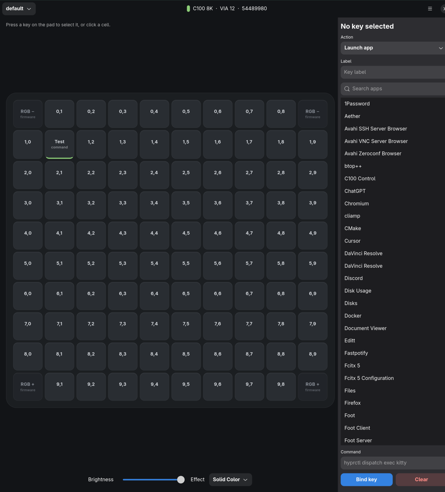

# C100 Control

Linux host for the **Keychron C100 8K** 10×10 macropad. Built for [Omarchy](https://omarchy.org/) (Hyprland / Wayland); runs on any Linux desktop with GTK4.

[Keychron Launcher](https://launcher.keychron.com/#/keymap) remaps firmware keys in a browser. Keychron Assistant (Windows/macOS only) can launch apps. This fills the Linux gap: a native GTK app plus a user daemon that binds each key to an action and keeps working after you close the window.



## What you can do

- Bind a key to an **app**, **command**, **key combination**, **macro**, **typed text**, **URL**, **media/system key**, **mouse click/scroll**, **lighting control**, or **profile switch**
- **Tap** launches an app; **double-tap** closes the matching Hyprland window
- **Hold** (400 ms) for a second action, including a momentary profile (layer-style)
- **Chords**: two or more keys together fire one action
- Per-key RGB, per-key effects, 24 matrix effects, **Mix RGB** (two zones, five timeline slots)
- Polling rate (125–8000 Hz), debounce, NKRO, idle-dim
- Macro recorder, lighting undo/redo, config import/export, key-test heatmap (hotter with more hits, on the pad and in the window)

Firmware keymap remapping, firmware flash, and Hall-effect features stay in Keychron Launcher. This app does not overwrite the identity keymap the daemon uses to tell keys apart.

## How it talks to the pad

The C100 enumerates as USB `3434:042c` and speaks **VIA protocol 12** on HID usage page `0xFF60`. Four corner keys are firmware lighting controls (`RGB −` / `RGB +`) and stay that way. The other 96 keys are yours.

```
C100 8K ── USB ──► kernel hidraw / evdev
                      │
                      ├─ VIA raw HID     firmware RGB, Mix RGB, poll, debounce, NKRO
                      └─ evdev grab      host bindings (apps / combos / macros / …)
```

The daemon **exclusively grabs** the C100 input nodes so pad keys never leak into the focused window (and never collide with another Keychron, such as a Q1). Combos, text, media, and mouse events are injected through a virtual `uinput` device.

On first connect, if the pad still has the factory map (every programmable key = `KC_1`), the daemon writes a unique identity keycode to each of the 96 keys. The previous map is saved under `~/.config/c100ctl/backups/`.

## Install

Omarchy already has the Python/GTK stack. On Arch-like systems:

```bash
sudo pacman -S --needed python python-gobject gtk4 libadwaita python-evdev python-pyudev hidapi
```

Then:

```bash
git clone https://github.com/rliessum/c100ctl.git
cd c100ctl
bash install.sh
```

That installs:

- `c100ctl` on your PATH (`~/.local/bin`)
- a desktop entry in the app launcher
- a systemd **user** service that starts with the graphical session

You need write access to `/dev/uinput` and to Keychron `/dev/hidraw*` nodes. A udev example lives in [`packaging/70-c100ctl.rules`](packaging/70-c100ctl.rules):

```bash
sudo cp packaging/70-c100ctl.rules /etc/udev/rules.d/
sudo udevadm control --reload-rules
sudo udevadm trigger
```

Then unplug and replug the pad (or log out and back in if `uaccess` needs a new session).

```bash
c100ctl doctor    # hidraw, VIA, evdev, uinput, Wayland
```

## GUI

```bash
c100ctl              # or: c100ctl gui
```

Four pages at the bottom of the window:

| Page | What it is |
|------|------------|
| **Keys** | 10×10 pad, bindings, per-key color, effect / brightness / speed |
| **Mix RGB** | Two lighting zones and a timeline of effects per zone |
| **Advanced** | Polling rate, debounce, NKRO, idle dim |
| **Test** | Heatmap of physical key hits — more presses glow hotter on the pad and here. Leave the page to restore lighting. Bindings still fire. |

Press a key on the pad to select it. Corner keys stay on firmware lighting.

**Selection**

- Click a key
- **Ctrl+click** add or remove
- **Shift+click** fill a rectangle from the last key
- **Drag** across the pad
- **Ctrl+A** all, **Esc** clear
- **Select same color** in the lighting row

**Menu** — provision identity map, new profile, save lighting into the current profile, import/export `config.json`, clear all key colors.

## Bindings

Each programmable cell has a type, a short label, and optional **On hold**.

| Type | Fires |
|------|--------|
| Launch app | `.desktop` id (via `uwsm app` on Omarchy). Tap launches, double-tap closes the matching Hyprland window |
| Run command | Shell command |
| Key combination | Injected combo, e.g. `Super+Return` |
| Macro | Step list (see below) |
| Type text | Types the string |
| Switch profile | Makes another binding profile active |
| Open URL | `xdg-open` (https assumed if missing) |
| Media / system | Play/pause, volume, brightness, … |
| Mouse | Click or scroll |
| Lighting control | Next/prev effect, brighter/dimmer, toggle, Per-key RGB, Mix RGB |

**Hold** (400 ms, while the key is still down): a second action. **Momentary profile** switches for the hold and restores on release.

**Chord**: select two or more keys, set the action, **Bind selected keys as a chord**. All those keys down together (within 50 ms) fire the chord instead of the individual bindings.

**App close** matches Hyprland `class` / `StartupWMClass`, not Chrome PWA windows.

### Media `--media`

`playpause` `play` `pause` `stop` `next` `prev` `mute` `volup` `voldown` `micmute` `brightnessup` `brightnessdown` `eject` `www` `mail` `calculator` `homepage` `screenshot`

### Mouse `--mouse`

`left` `right` `middle` `back` `forward` `wheelup` `wheeldown`

### Lighting `--light-action`

`next` `prev` `brighter` `dimmer` `toggle` `perkey` `mix`

### Macros

Comma-separated steps. **Record macro** in the GUI captures keystrokes in the window. **Repeat while held** loops the macro until release.

- `ctrl+c` — combo
- `delay:80` — milliseconds
- `text:hello` or a bare word — typed text
- `down:shift` / `up:shift` — hold a modifier

## Lighting

Per-key colors use firmware **Per Key RGB** (effect **23**). Mix RGB is effect **24**. Setting a key color switches to per-key mode.

**Keys page**

- Brightness, matrix effect (0–24), speed
- Global effect color (used by Solid / Breathing / some reactive modes)
- Per-key FX: Solid, Breathing, Reactive, Reactive wide, Splash
- Palette + color picker; undo / redo; clear all

**Mix RGB page**

- Paint keys into Zone 1 or Zone 2
- Up to five timeline slots per zone: effect, hue, saturation, speed, duration 1–99 s
- **Write Mix RGB to pad**

**Save lighting to profile** stores the current lighting with the active binding profile so switching profiles can restore it.

Effects 0–24:

| # | Effect | # | Effect |
|---|--------|---|--------|
| 0 | None | 13 | Rainbow Beacon |
| 1 | Solid Color | 14 | Jellybean Raindrops |
| 2 | Breathing | 15 | Pixel Rain |
| 3 | Band Spiral Val | 16 | Typing Heatmap |
| 4 | Cycle All | 17 | Digital Rain |
| 5 | Cycle Left Right | 18 | Reactive Simple |
| 6 | Cycle Up Down | 19 | Reactive Multiwide |
| 7 | Rainbow Moving Chevron | 20 | Reactive Multinexus |
| 8 | Cycle Out In | 21 | Splash |
| 9 | Cycle Out In Dual | 22 | Solid Splash |
| 10 | Cycle Pinwheel | 23 | Per Key RGB |
| 11 | Cycle Spiral | 24 | Mix RGB |
| 12 | Dual Beacon | | |

## Advanced

Written only when you click **Apply** in the GUI or run `c100ctl advanced` — not on every daemon start.

| Setting | Values |
|---------|--------|
| USB polling rate | 8000, 4000, 2000, 1000, 500, 250, 125 Hz |
| Debounce mode | 0 defer global, 1 defer per row, 2 defer per key, 3 eager per row, **4 eager per key** (recommended), 5 eager defer per key, 6 none |
| Debounce time | milliseconds |
| NKRO | on/off |
| Idle dim | seconds of no pad input before brightness goes to 0 (host-side; 0 = off). Next key restores brightness |

Firmware version is shown in the header (read from the pad).

## CLI

```bash
c100ctl                  # GUI
c100ctl status
c100ctl doctor
c100ctl list
c100ctl provision        # rewrite identity keycodes (backs up first)

c100ctl bind 2 3 --app kitty.desktop --label Kitty
c100ctl bind 0 1 --combo 'Super+Return' --label Terminal
c100ctl bind 0 2 --command 'omarchy launch browser' --label Browser
c100ctl bind 4 4 --macro 'ctrl+c, delay:80, ctrl+v' --label Paste
c100ctl bind 5 0 --text 'hello' --label Hi
c100ctl bind 1 1 --url 'https://omarchy.org' --label Web
c100ctl bind 1 2 --media playpause --label Play
c100ctl bind 1 3 --mouse wheelup
c100ctl bind 1 4 --light-action next
c100ctl bind 2 0 --app kitty.desktop --hold-profile gaming --hold-momentary
c100ctl bind 2 3 --clear

c100ctl light --brightness 200 --effect 1 --speed 180 --effect-color '#ff8800'
c100ctl light --per-key-type 1          # breathing
c100ctl light --key 2,3 --color '#ff8800'
c100ctl light --key 0,1 --key 0,2 --key 0,3 --color '#00ff00'
c100ctl light --key 2,3 --color off

c100ctl advanced --poll 8000 --debounce-type 4 --debounce-ms 5 --nkro 1 --idle-dim 0

c100ctl profile                 # list
c100ctl profile --create gaming
c100ctl profile --use gaming
```

Cells are `row,col` with row 0 at the top and col 0 at the left. Corners `0,0` `0,9` `9,0` `9,9` cannot be bound.

## Files

| Path | Purpose |
|------|---------|
| `~/.config/c100ctl/config.json` | bindings, lighting, Mix RGB, advanced, chords, profiles |
| `~/.config/c100ctl/backups/` | VIA keymap snapshots from provision |
| `$XDG_RUNTIME_DIR/c100ctl/c100ctl.sock` | GUI/CLI ↔ daemon |
| `$XDG_RUNTIME_DIR/c100ctl/c100ctl.lock` | single-instance lock |

Config version is **2**. `lighting.keys` maps `"row,col"` to a hex color. `chords` is a list of `{keys, binding}`. A profile may include its own `lighting` object (written by **Save lighting to profile**).

## Uninstall

```bash
systemctl --user disable --now c100ctl.service
rm -f ~/.local/bin/c100ctl
rm -rf ~/.local/share/c100ctl
rm -f ~/.local/share/applications/c100ctl.desktop
rm -f ~/.config/systemd/user/c100ctl.service
```

## Arch Linux / Omarchy (system package)

For a proper system-wide install on Arch-based distributions (including Omarchy), use the PKGBUILDs in `packaging/arch/`.

### Before installing

If you previously installed via `install.sh`, remove the user-local files first:

```bash
systemctl --user disable --now c100ctl.service
rm -f ~/.local/bin/c100ctl
rm -rf ~/.local/share/c100ctl
rm -f ~/.local/share/applications/c100ctl.desktop
rm -f ~/.config/systemd/user/c100ctl.service
systemctl --user daemon-reload
```

### Install the -git package (tracks main, works before the first release)

```bash
git clone https://github.com/rliessum/c100ctl.git
cd c100ctl/packaging/arch/c100ctl-git
makepkg -si
```

### Update (pull, build, pacman -U)

```bash
bash packaging/arch/update.sh
```

That fast-forwards `main`, builds `c100ctl-git`, and installs the archive with `pacman -U` (sudo). Use `--stable` after a version tag, or `--ask` to confirm each step.

### Update the -git package by hand

```bash
cd c100ctl
git pull
cd packaging/arch/c100ctl-git
makepkg -si
```

Or re-clone from scratch:

```bash
rm -rf c100ctl
git clone https://github.com/rliessum/c100ctl.git
cd c100ctl/packaging/arch/c100ctl-git
makepkg -si
```

### Install the stable package (after v1.4.0+ tag exists)

Once a release tag is pushed, the stable package can be built:

```bash
git clone https://github.com/rliessum/c100ctl.git
cd c100ctl/packaging/arch/c100ctl
makepkg -si
```

To update after a new release, pull the latest PKGBUILD and rebuild:

```bash
cd c100ctl
git pull
cd packaging/arch/c100ctl
makepkg -si
```

### After installing

```bash
systemctl --user enable --now c100ctl.service
```

Then unplug and replug the C100 8K for udev rules to take effect.

```bash
c100ctl doctor    # verify setup
c100ctl           # launch GUI
```

### Differences from install.sh

| | `install.sh` | Arch package |
|---|--------------|--------------|
| Binary | `~/.local/bin/c100ctl` | `/usr/bin/c100ctl` |
| Service | `~/.config/systemd/user/c100ctl.service` | `/usr/lib/systemd/user/c100ctl.service` |
| udev rules | manual copy | `/usr/lib/udev/rules.d/70-c100ctl.rules` |
| Desktop entry | `~/.local/share/applications/` | `/usr/share/applications/` |
| Icon | `~/.local/share/icons/` | `/usr/share/icons/` |

Both methods share the same config at `~/.config/c100ctl/config.json`.

## Creating a release (maintainer)

1. Bump the version in `pyproject.toml` and `c100ctl/__init__.py`
2. Update `packaging/arch/c100ctl/PKGBUILD` pkgver and regenerate `.SRCINFO`
3. Commit: `git commit -am "Release vX.Y.Z"`
4. Tag: `git tag vX.Y.Z`
5. Push: `git push && git push --tags`

The GitHub Actions workflow creates a release with the source tarball automatically.

## Tests

Unit tests do not need the pad. A live hardware check is skipped automatically if it is unplugged.

```bash
# from the repo root, with the same Python that has evdev/gobject
python3 -m unittest discover -s tests -v

# coverage (omit GTK UI)
python3 -m pip install -e '.[test]'   # pytest, pytest-cov, coverage
python3 -m coverage run -m unittest discover -s tests
python3 -m coverage report
python3 -m pytest --cov=c100ctl --cov-report=term-missing
```

Live hardware test (skips if the daemon holds the VIA interface):

```bash
systemctl --user stop c100ctl.service
python3 -m unittest tests.test_hardware
systemctl --user start c100ctl.service
```

## License

MIT. Keychron is a trademark of its respective owner; this project is not affiliated with Keychron.
